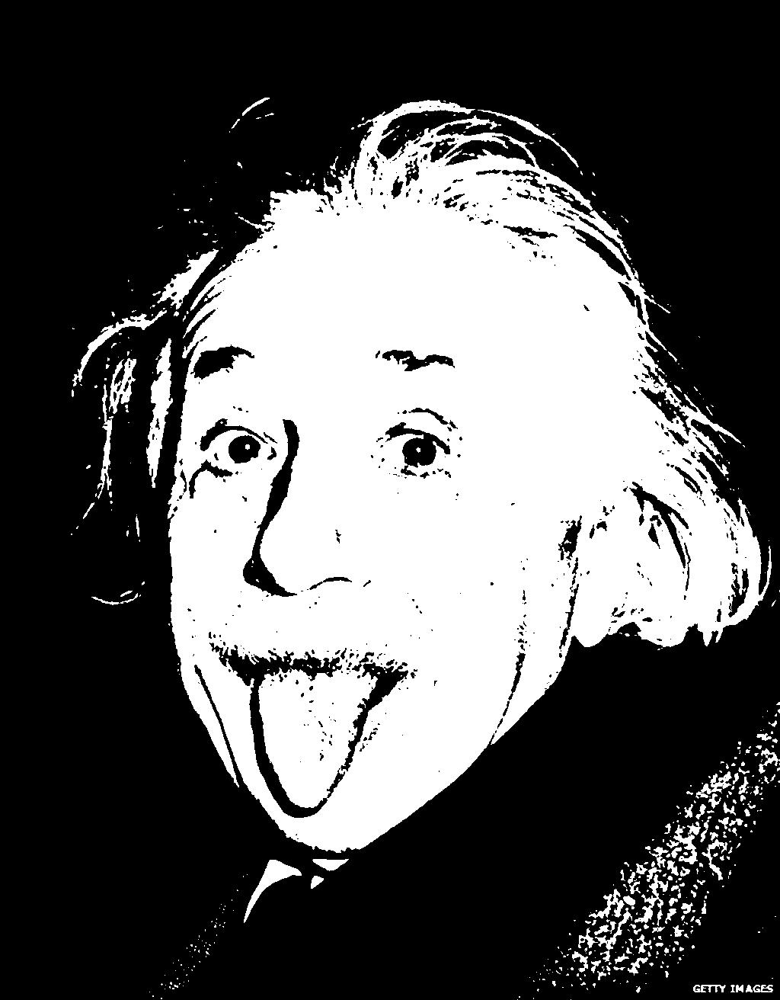

# ascii-art
Generate ascii art from pictures

Generation is done with Noto Mono for Powerline for regular text and Symbola for
unicode braille symbols. Results may look slightly different when using a
different font. Does not work on pngs.

Usage: `python main.py -h`

Requirements: `scikit-imag`, `numpy`, `Pillow`

## Description

The purpose of this project is to convert images to ascii art. The basic
strategy is to take an n\*m resolution image and break it into chunks matching a
target resolution. I then use a variety of methods to convert each one of these
chunks into a single character, giving an ascii image of the target resolution.

The described strategies will be exemplified on this image of Albert Einstein.


### Strategy 1: Blockify

This was my first strategy, meant to act as a quick test to verify the algorithm
for breaking the image into chunks was working correctly. This strategy is to
convert the image pixels to grayscale, using a 0.2125/0.7154/0.0721 multiplier
for each of the rgb values. From there we just average all the values in the
chunk and scale that to a gray value from the 256 available ones in the
terminal. Using ansi escape codes, we can then print it out.


### Strategy 2: Asciiify

Blockifying the image works quite well, but only works in terminals, and only
ones that support 256 colors. The next step was to use actual ascii characters.
Taking a naive approach, this strategy changes the image to grayscale the same
way as the first, then creates an image of each ascii character (A-Za-z and some
punctuation) that is the same size as each chunk. It then averages the
brightness of all the pixels in the character image and finds the one closest to
the average brightness of all the pixels in the chunk. This strategy works
fairly well, but lines and edges in the image can be made cleaner.

```
__~__~~~~~~__~_____~_~~~____~;_____~__~;~~__"""""""""""""""""""""+++++++^^+++"""""""+""""""++"""""""
__~~~~___________"_~__~~~~__~~~~;~___;;;;;~~____"_"_""""""""""""""""""++++++++""""""""""""_"""_""_""
____~_____"____________;;~;;;~~;;;;;;;;;;-;;;;;;~_____"__"_______""""""""+""""""""""""""""""""++^++"
_~________""____________~;;;;;;;;;;--;-------;;;;;~~_______________"""""""""""""""_""__""++^^++"""_~
~~________________~_______~~~;;;;;------:-:----;~__;~~~__~~~____________""________""+^=r=^++"""___;-
__"_"__""________~_________~~;;;;---:::::::::--~-;~;;;;;~~~;~~_~__________~~___"^^^=++++++""__~;;;--
""""__"___________________"_~~~_+^""~~;;;;;;;;~;_"+1(i]]z(r+"""_~_~~~~~~;_""""""""++++"""___~;-----:
"__"__"""____""________"_"____^=_"+"_~;;--;;_"r(}F]c??rrrczz]vvv((c|""""""_""__""""""""___;-------::
""""___"_""__"_""""""""""""""r=_~___;;;;;--;=1(fZz||1|]flii}vlu]((r?}z(+""___""__"_"__;;---::::::::.
""""""""____""""_"__""+=""""+|++""_~__~~;_+^"|yk]r(caFu}ivlv?(v|???i=^=r|"""~_""_____;---:::........
+"""""""""""""""""++++"==^++^r(r+r=^^r=++^c(i]alyaaVffyfyFFeZPhkVValfr+=+(^"_;;_~;;-----::........::
"+""""""""""""+"""+++^^+^=rr==rrr^=rr1(c(cizuukayeyf]fVkZZVVVeVVaFff}Fyf?"=+^_;;---::::........:..::
++"""+""""""""++"""+^=r+rr1|r||1|(v}lfyuu]fyaykyyy]uyyeaFfuakZZZaFFyylu]}u}1=+"~-::::............:::
^+""+"""""++"+^+"""++r|??||r|1(|1c]ykZkVFyuFFVeeeaeeeVVaeyufyuFeVkZZZkayu]z]c=++"-::.`..``.......:::
=++""""++"""++""""==rrrr1?(c?((cv}laVkeeVVkVZkkZkkZZZZZkZVeaayuyyuluFFaVaufuaaz=";..:..`````..:...::
=^^+""++++"""+""+"^"+^=rr|(ic(?c]uyFVVVkkZZZZhhhwhPPPPhhPhZkVVeaFuyuufyFeVFvify]+:-....`..```...::::
rr=+""++^++^+++="""""^+rvfav1ilFeekZZZZhZZZkZhhPwwwwPPPPhPhZZkkVVaaFyyuFekkZei?fz":-.......`.....:::
|r=+++^^r^+++++^^++""=cfVa1cyVZZhPwwwGGGwGGGdddgdggggdgOgGwwPhhZkVeaeaaFeVVVkZuifz;-.....`..`.:.::::
||r=+++++^+""""+=+^(ifuac|lFeZwwdgggOgdddgOOgdgOOOOO%%%gGPPwwGPkZZkeeeeFFaeekkVFiFv+-````````..:::::
|r|r++++^""__"+^^r(?zv]|1}yFkhwdgOOOOgOOOgOOggdgOOR%OOdddGddPZZZZZhZVVVaFFaVkZZkei]r=+-.`````.::::::
|||r^++++"""+=c}]lfz?((|vuyZPdgg%O%%OOOOOgOOOOO%RRRRR%OOOOGPhPhZZhhkZeVeeaaeZZZhZefr;_-_~.````.:.:::
1|r=++""""^rvF](rrr||?r1zakZhGO%ORRR%OOggOOOOOO%%O%%OOOOgddGdhZhPhhPkhZVVaVkwhZhkkfv^-..-"-```.::.::
r||r++"+""rf(=|r??|=iy"c]F?(|(]akGOOOOOgggOOgGwwVyyfyPPkZPGwGGwPZZZZwZZZVVZhZwZVaFai(r_:.:~;.``....:
rr=r+""""=}""||vyvr?uy+^u|"r?zeZZPOOOOOddgOOGwddhwZFz}uaVaZgdGwPPZZhPZkVVVZwGPZZeFuui^==~-~__.`.....
rrrr=++++ic++1}zf||}ea^rFykPPPPwwddO%%OOO%%RO%%RR%OO%%OOggOgOwhZhPhGwZhkkVZGgGZeayuf]v="";:.:;-:....
||r==rrr"r=_^iff]|1lVF^iVPdgwPPwPZhdOOR%RRRR%OgOgdgOOOO%%%OgdGZkZPPPwPPPPZZPdGZkkey}z]z1|+_:`..::...
r=^+^=+"""__+z}1cr1zFv"yZOwhFaFFVZZeaZO%RR%OgddGGhVaFuFFyhOOOwZaZhGGwGPGPwwGdOOgGwkeFz}]uuv+-:`..:::
^^""++"_;-;~"zi=1=|fyr"eZZuczeFfuaewy?VgOOgddhkZZa}vffFaauaGwwZeVhPwPwkPwPwwdddwhZPPeyful]vvi+:.....
=+""""";---;_lr=|r?eyr=aZF?F%u_++FVaerydgdwGZZkVyeGP=^~=}]VkwhwZkZwPhZZZhwGGGGddZZeeeeylFyuv^"+":..:
+""_""";---"+u==1rrei|iFkZfyVF(1FZFV]ikhwwPPkGwVaVkVr""iVFkZZPwPZZwPhZkZhwPPwhkZkVVeauyeyuzizr--";::
"_~;~__~;"+_"f=_=^"}^|]fyuFl}uaVZZZ}=fZwPhZhPZhVaeeayeyaaFVkeVPwhhhPPZZkZPwPhkaaeekkeeallyf(=cr-.;-.
_;-;-~"~;;_;(rr;~""="|ay}VZkZhhVZZu=1VPPZkhZZPGdGPZZhPPZhhVeZZhGwZZZZkVVkZkVaaVkF}cfaeaeylVu(rc";.~-
~;---;_;-~_r+_=;-_~;;cyhZZGddGwZdG?|aZhhZVVZhPGg%OOGOgdGwPhhhZZhwVVZkkeVekeeeuukhkfy|vfaVVaky]?z_;.;
-:::--;-;_^~~"_;"r-;-1kGOgdggddgh]cVhhPhZeaeZwdddOO%%%%OOOOOOOdwPZVVVVVau]fVu}hdPVFfl?lykhZhZyyy?_~;
::.:--;__"~;;;--_"~-;|PO%%OGGdGPFiZwgOOgGPVueewRROO%%%%%R%%R%OOghZakeeeF]caFhwGO%hwlawiekgdGwFeZZr^-
::..:-~~~;-:-;;;~~~-;+ZOOOdGGdgg(}wg%RRROGZVZkehO%RRRR%%O%R%%OOghZaFaeau]]eZOOg%RPG%GRG?V%R%OkekG]1:
::..:;~--;~-----;-;;;"kwGwPdOOgc?rlhdggdPZZZGdZFwgGRRRR%%O%OOOggwZeyeeFuulyedPO%wZkRNOOFVNR%%kafdl]~
::..:-;---~--;-;_"+;;=khZhd%%OPFv1"|yaaeeZVZkVVZddghdO%R%OgdgdGPGhaueeFyylkO%GwhkggwGgPkdWROOk}iP}1"
::..::-::::;""+=++~-;=kkahgOgPkZPZkkkhhZkhhhZPwwGwdGZZdgOgGGGdgdwZFueaaaalwO%GZeVZZgOwhZNNO%wa?aVi"+
:...::::::::::::;;;--+ZZyZZPZZhZwdwhwwwZwgdGhGddhZhkhPZdgdGwPdddwkyyeeaaukOGdZyyeaaFkZhdgP%Geeafr_;-
:...:..:::::::::-;-.._FhaVkaZZwZwGhZwgwdGGwwhPPwhGgPkZwZwdGGGddGhafuFVeF]V%Ohazr==ZPVZZV1cZu]_;:----
::..::::::::::::-:...:cZekkffuuekPeZkZZaZhZVkekaZZhhhwwPGwdwPGGwkaffekaul""(+-:::-;+?1r_;_?+-::--:--
-:..:::::::::........."aVyGPyz|=1+??(}c1?zv}uy]zlllyVkwwhdGwwwwPhe}ehZFf(_-.::::::::::::::-::--:----
-::.::::::::::........:lZfeOOGev?|uuuaauyFFeeeyl|_+zFVPVhdwhGGdGhFlwPkl^-....::::::::::::::::::::--;
:...::::::::::..`..`...~awyhOgGP+uVkeZeaVeVFZVyz|iaVPGkeGGhhdggdPuPGZ?-.....::::::::::::::::-::-:-_^
:....::::::::::......`.._aGyd%Od"lPPZZVkVVyePZv]yFkGOdPkdGZGgOgdVwdv~::::..:::::::.:::::::-:::::~^r?
::::::::::::::::.........-]dyO%O^^wwhhZaeFyZZ]vuukwGgOgPgGZOOOdkZ]~:::::::::::::::--:::::::-::~^+1cv
---;;;~;--::::::::.::..``.:]ha%O}~ZgGwkeaFyPyzfFhwGPOOOOOhGOOdu(;:::::::::::-:----------:---~+?|?viv
""+""""_;-::::::::::::..``.:uyPgk-vPdGaZeuVV]aZPGggO%%%%OPOOPr-::::::::-::::---;;---;-----;"||?c?vlz
rrr=^=+"_;-::::::::::::..`..:}(PGc:zPGkkakelePGgOO%RRRROP%Gi;::.::::::--::::----;--;-;;-;"r?i}vv?zcc
rrrrrr=+"~;::::::::::::::....."+aPi:zZVhZefZOOOOO%RRRROGa=-:-:::::::---::-;;;;;;;---;-;"?vflzvv}iv1|
|rrr|rrr+"_-:::::::::::::::.....-(Zf;+i}]aOO%OOOORRRRh?~::::::..:::::----;;;;;;;-----;r(cc}}(zivi?=^
||rrrr1|^^"_-:::::::::::::::......"feffed%%OO%%%RRgu^-::::::::::::--:----;;~;;;;--:;+(civzz1v}}i(|"_
r1rrrr|rr"~-::::::::::::::::::.....-ruVwwdGPPPGdyr;----:::::::::::::-;;;;;~;;;----"rri}lf}v}iv?1="_;
||rrrr";--:::::::::::::::::::::-..::..;"r1cvir+;::::--::::::::::::-;;;;;;;~;;;--"r(c]zl}fvv}}v1+""~_
r|r+~--::-::::::::::::::::...-~""-VOkz"."iy?~:::::::::::::::::::---;;;;;;;;;;;"1cvz]}}]zii?z?1r+";""
r";------::::::-:::::::::...-_"=+eZlc^r=F_::::::::::::::::::::-----;;;;;;;;;;"1?z](]l}virc|1c|+";""r
;----------:::::::::::::...:_+="V="=r="-::::::-::::::::::::::-:---;;;;;;--;"rcl}]zi]}cz??ccrr+";_"^c
------------:::::::::::..-_+rr+1+r|+;-:::::::::::::::::::::-----;;;;;;-;-"^(v}z]]i]]vcczvicr++~~"^c1
-::----------:::::::::.-;"^|r+:_r";:::::::::::::::::::::::::-----;;;;;-_rr|zz]}}?zzcv|izc(r^^";"=|_-
:::----------:::::::::-"=|(r+:-;::::::..:..::::::::::::::::-------;;-;+(((zlvz]1vi]vv?cc1=++";""_;--
:::::---------::::::-;+=rrr"-::::::.........::::-:::::::::::-------;_rrccizzzzivi}vi(c1|+""";;~~__~;
-::::::----::::--::;"=r1r"-:::::...........::.::::::.:.:::::.:::::;+|?ic((zcvccccc1=r1="_+";~;-;;~~;
-:::.:::::::-::-:-_=rr=~::-::....``..`````........::......``````._rr11|r(1(|r^rrr1=^++"~~1r=+"r=r1|_
```

### Strategy 3: Advanced Asciify

Following in the footsteps of asciiify, I figured I could do better by looking
at what the characters actually look like, instead of just their average
brightness. The third strategy is identical to asciiify, but when comparing the
character image to the chunk, I check the difference in brightness between every
individual pixel, and score the character based on its mean square error. This
method does give much cleaner edges but at the cost of more time and a
drastically higher contrast in the final product, leaving background details
left out.

```
                                                                                                    
                                                                                                    
                                                                                                    
                                                                                                    
                                                                                                    
                                                                                                    
                                ,-                  _,,-.__                                         
                                                 _F `     __._    __                                
                                               _B     _=_  ____     "-_                             
                                              _B    _4_       _   `     .                           
                                              _ ___B' _____ggBBBBBB__    '                          
                                            __B___F  _BBBB"IB_g_____ 4"=_                           
                                     ____  _H_B___ __ IF_="_BBBB=___  ._ "_                         
                                   _ZBBB___ _I____B_BBB_____  ==DBBBBB__ __                         
                                   _BIIIBBBBBBBBBBBBBBBBBBB_____ "  =FB_"'=_"&_                     
                                ___FBIBBBBBBBBBBBBBBBBBBBBBB_BII_ =______B_  "_                     
                         __    __BBBBggBBBBBBBBBBBBBBBBBBBBBBBBB______ _IBBBB_ \                    
                       _g#  _HBgBBBBBBBBBBBBBBBBBBBBBBBBBgBBBBBgIB__z_I_IBBIBB__'                   
                     _=I' =_F_gBBBBBBBBBBBBBBBBBBBBBBBBBBBBBBBBBBB_B_II__I__BBB_ T_                 
                          _=BBBBBBBBBBBBBBBBBBBBBBBBBBBBBBBBBBBBBBBB_BB____BBBB_B_I                 
               ____     _F_gBBBBBBBBBBBBBBBBBBBBBBBBBBBBBBBBBBBBBBB_B_BI___BBBBBBI_                 
            _a"          4BBBBBBBBBBBBBBBBBBBBBBBBBBBBBBBBBBBBBBBBBB_BBBBFBBBgBBBB \                
           I`        _   F "`  "BBBBBBBBBBBBBBBBB""""BBBBBBBBBBBBBBBBBBBBBBBBBBI__I                 
                _   '_  z   ___BBBBBBBBBBBBBBBBgggB_____g_gBBBBBBBBBBBBBB_BBBBBBB_ `                
              ,    _gF  =_gBBBBBBBBBBBBBBBBBBBBBBBBBBBBBBBBBBBBBBBBBBBBBBIBBBBBB=_                  
              I '   I_  ]BBBBBBBBBBBBBBBBBBBBBBBBBBBBBBBBBBBBBABBBBBBBBBBBBBBBBBg___                
                       _BBBB=F_-IBg_IBBBBBBBBBBBBB__-___"BBBBBB_BBBBBBBBBBBBBBBBBBBB=   =__         
                    _  ]BBF ___Z IBB_ IBBBBBBBBBBF` _*#BB__BBBBIBBBBBBBBBBBBBBBBBBBB_  _ _ "=.      
             _     _F  _BI_HBF   _g,I _BBBBBBgg___BB ,  _ BBBBBBBBBBBBBBBBBBBBBBBB__BB__I='_        
             I     I   __B ,Bk__gZ_g' BBBBBBBBB_TTBB   _F_&BBBBBBBBBBBBBBBBBBBBBBBFF_ =___          
                        F___ ___BBB"  BBBBBBBBB__B_________BIIBBBBBBBBBBBBBBBB__FBBB_=I '_          
                      I_ IBIBBBBBBr  BBBBBBBBBBBBggIBBBBBBFIBBBBBBBBBBBBBBBFI_BF_  "I_=I_ B_        
                      _BBgBBBBBBBB  _BBBB_BBBBBBBBBBBBBBBBBBgBBBB__BB]IIIHBI_  BBB_L  =_BI_I__      
                      ZBBBBBBBBBB' gBBBBBI_IBBgBBBBBBBBBBBBBBBBBBBBBBIBI   ]' gBBB_ __=_IBBBB=__    
                      BBBBBBBBBB# gBBBBBBBB_I_BBBBBBBBBBBBBBBBBBBBIB_IF_  __BBBBBBB_IB DgBBBB_IBL   
                      BBBBBBBBBB  BBBBBBBBB_Bg_BBBBBBBBBBBBBBBBBBB_____   IBBBBBBBgBgBB ABBBBB_HB,  
                      BBBBBBBBB   `BBBBBBBBBBBB_BBBBBBBBBBBBBBBBBB__B___   _BBBBBgBBBBB__BBBBB_ BI] 
                      4BBBBBBBBL_   T"TF_ggggI_gBBBBBBBBBBBBBBB]BBI _____ gBBBBBBB&gBBBBgBBBBB  B   
             -        BB=BBBBBBgBDgBggBB_BBBBBBBBBBBBBBBBBBBBBBBBB__II___ BBBBBF_BBBBBB_BBBBHH _B   
                      BB BBBBBBIBBBBBBBBBBBBBBBBBgBBB&BBBBBBBBBBBB  FI__ qBBBB _B#F_F]BBBBBB__4F    
                      ]B_]FFBBBBBBBBBBBBBBBBBBBBBBBBDBBBBBBBBBBBBF  _BB_ #BBBF= . IBBBBB  B"`       
                       BIBB_' 'IBBHBBBBFTBBHBBBBBBBBBBBBBBBBBBBBB_ __B_    "        `'`             
                       IE'Bg_                F `"" 'IBBBBBBBBBBBBI _BB=                             
                        B_TBBBg_  _________BB__    __4BBBBBBBBBBB__BBB                              
                        IB_BBBBB  _BIBIIBBB_BB'  __ggBB_BBBBBBBBB_BBB'                              
                         TB_BBBB IggBgTEBI__BE _=__BBBBBBBBBBBBBFgBF                                
                          "B_BBB  BBBBB_BI_BB   _gBBBBBBBBBBBBBFgP                                  
                           "&TBBL BBBBFII _g_  _BBBgBBBBBBgBBBF'                                    
                            TLBBE  BBB_BB_]B ]gBBBBBBBBBBBBBB'                                      
                             " BB_ "BBBB_BI _gBBBBBBBBBBDBB"                                 _      
                                BB_  B_BBF gBBBBBBBBBBBB#`                                          
                                  BL     _BBBBBBBBBBBB"                                             
                                   TBaagBBBBBBBBBBBP                                     ._         
                                     THBBBBBBBBBP`                                     __'          
                                           '                                          , '           
                                  gBg__  "B"                                       ,  _             
                                 g#"    #                                                           
                                a                                             _ .                   
                               ,                                                  _                 
                                                                               .                    
                                                                                                    
                                                                                                    
                                                                                                    
                                                                                            ` ' "^` 
```

### Strategy 4: Preprocessing + Advanced Asciiify

I thought perhaps I could reduce the amount of contrast caused by strategy 3 by
running some preprocessing on the image with Pillow. Strategy 4 is to first
convert the image to only black and white pixels, and then run strategy 3. Both
steps are shown below.



```
                                                                                                    
                                                                                                    
                                                                                                    
                                                                                                    
                                                                                                    
                                                                                                    
                                ,+                 ____g,__                                         
                              ,`               .ggP"``    __,__" +,_                                
                                               qM.    gg________.  `*u_                             
                                              $M(  _B&I/.`P`  _ ` "L   '.                           
                                          .  qBiT&BMTHMWgC_ggBMMMMBp]    "                          
                                       .    g]MM&MPA_gMMMMBBMMMMMBgg &Bq_                           
                                   wgggggJ*gBHM&BB_gg&BM%#PgMMMMMMQ_BH&_x*L                         
                                  _&MMMMB&WMMMMMMgMMMMMMMggJ&M&BMMMMMMBPQ__"_                       
                                 +ggMMMMMMMMMMMMMMMMMMMMMMMMM&ggMPPPMBMMQB&g*B_ `                   
                                _gMMMMMMMMMMMMMMMMMMMMMMMMMMMMMMMBMgBgMMMBg `R_\                    
                        __gF  gMMMMMMMMMMMMMMMMMMMMMMMMMMMMMMMMMMMMMwg&MMMMM&_ &                    
                       _g# _yMMMMMMMMMMMMMMMMMMMMMMMMMMMMMMMMMMMMMMMMMMMMMMMMMg_Aa                  
                    .gAM" 42MMMMMMMMMMMMMMMMMMMMMMMMMMMMMMMMMMMMMMMMMMMMMMMMMMMg"M[                 
                    ' d ,`]&MMMMMMMMMMMMMMMMMMMMMMMMMMMMMMMMMMMMMMMMMMMMMMMMMMMM&]$"                
              `_ygB-` ` _P_MMMMMMMMMMMMMMMMMMMMMMMMMMMMMMMMMMMMMMMMMMMMMMMMMMMMMMB_                 
            _p*          &BMMMMMMMMMMMMMMMMMMMMMMMMMMMMMMMMMMMMMMMMMMMMMMMMMMMMMMB]\                
           I`        B J'#**` _"BMMMMMMMMMMMMMMMHP***MMMMMMMMMMMMMMMMMMMMMMMMMMMMM&'                
          ]    FN   &g  #   __MMMMMMMMMMMMMMMMMMMMMg__ggggMMMMMMMMMMMMMMMMMMMMMMMMRT.               
         J`  ,]qj  ,gB  MB&MMMMMMMMMMMMMMMMMMMMMMMMMMMMMMMMMMMMMMMMMMMMMMMMMMMMMMgQgg_.             
         '   flQT  IMg  MMMMMMMMMMMMMMMMMMMMMMMMMMMMMMMMMMMMMMMMMMMMMMMMMMMMMMMMMMg_ 7X .           
             ]J     M  IMMMMMMg&MMMMMMMMMMMMMMMMMMM&&ggZPMMMMMMMMMMMMMMMMMMMMMMMMMMM& _"&&_         
             *L    Ag  gMMP`___ZNBMML BMMMMMMMMMMP" **MMMQgMMMMMMMMMMMMMMMMMMMMMMMMMMR#&]_ *+,      
             J     &&  BM]_gMF   }BBB jMMMMMMMMMggM# ,  _NM&MMMMMMMMMMMMMMMMMMMMMMMMMMBqgbBL  `     
             [     ML _MMBHbMg__gMQgF_MMMMMMMMM&M&MB   _MM&MMMMMMMMMMMMMMMMMMMMMMMMMMMMB&g`-`.      
             D     V  '_FgBg,_MMMMM" jMMMMMMMMMMMBBggg_WMQMMMMMMMMMMMMMMMMMMMMMMMMMMMMMy*b3 `       
                      B& BMMMMMMMMP  MMMMMMMMMMMMMMBMMMMMMMMMMMMMMMMMMMMMMMMMMMMg_'#MMMMgaMZ        
           z          HMMMMMMMMMMM  BMMMMMMMMMMMMMMMMMMMMMMMMMMMMBMMMMMMMMMMMPQMMMJg_"RBMMBMML r    
                 ]    BMMMMMMMMM&F_&MMMMMMMMMMMMMMMMMMMMMMMMMMMMMMMMMMMM&DJMF"MMMMgH_,9_MMMMM&W]    
                      MMMMMMMMMM#_MMMMMMMMMWMMMMMMMMMMMMMMMMMMMMMMMMMMMML B&&MMMMMM_TM MMMMMMgMM&   
                      MMMMMMMMMM IMMMMMMMMMMMMMMMMMMMMMMMMMMMMMMMMMMMMMB}JBMMMMMMMMMMM& &MMMMMMMMLJ 
                      BMMMMMMMM   *MMMMMMMMMMMMMMMMMMMMMMMMMMMMMMMM&MMMMMFBNMMMMM&BMMMMgTMMMMBd*Ml] 
                      BMMMMMMMMg__ 'MMMBBggggBBMMMMMMMMMMMMMMMM&MMMMMMBMMUgMMMMMMMMQMMMMgMMMMB ,MLr 
             -. -`    MMMMMMMMBMMMMMgMMMBMMMMMMMMMMMMBMMMMMMMMMMMMM&MMMMM_MMMMMMBMMMMMM&MMMMBM JM*  
                      MMBMMMMBMMMMMMMMMMMMMMMMMMMMMMMBBMMMMMMMMMMMMMMMMMBgMMMMBQB&PNMMBMMMMM]&&P    
                      MMMMBRMMMMMMMMMMMMMMMMMMMMMMMMMMMBMMMMMMMMMMRgBMMB`MMMMB# . BMMMMB  B*F       
                      `MMMM]hV]BMMMBMMMMBMBMMMMBMMMMMMMMMMMMMMMMMMBMMMMBp `*`       "*"   '         
                       gMMMM_L    `  '   r'-PB}'MZ]RMMMMMMMMMMMMMM'&MMMM                            
                       TMgMMMMg - BggBMggMgMM&g&   _&&M#MMMMMMMMMB,MMMM`                            
                        BMLBMMMM &MMMMBBMMMMMMMF _&MMMMMMMMMMMMMMhMMMP                              
                         MMLMMMM 4MMMMMMMMMMMB yMBMMMMMMMMMMMMMMP&MP                                
                          NMHMMM  MMMMMMB&MBML BMMMMMMMMMMMMMMMBgP                                 '
                           T&TMML MMMMMMMQNM# &HMMMMMMMMMMMMMMPf                                 _" 
                            NLBMg TMMMBMM]MMFgMMMMMMMMMMMMMMM'                                    IL
                             N MM_ *MMMMMMMPgMMMMMMMMMMMBMM*                               ,_],~.*  
                              ' BBL NMMMMB`gMMMMMMMMMMMMM`                              __A#f' f    
                                 'Mg "9MP_MMMMMMMMMMMB*                                 ,  Y _  .   
                                   MMgggMMMMMMMMMMMP`                                   `I, -r-     
                                    `MMMMMMMMMMMP"                                    ._j"'x `      
                                         **P""`                                     g-z " ."        
                                  gMg__ `*M*                                     _yJl L `, v        
                                 gM*`   M                                        - ,H,_. ;  "       
                                d                                             H_q, ,\ .             
                               J                                            oH F} _kJ_',' '         
                                                                           -,#/( t  = j-            
                                                                          rJ "P , [.~,;,            
                                                                         'T ,  = _=,                
                                                                          `      "   '              
                                                                                         ~  ` ' "^` 
```

### Strategy 5: Braillify

The results from the preprocessing were a bit of a mixed bag. Similar to
strategy 3, the result is an even sharper, but higher contrast image. A lot of
detail ends up getting lost. On black and white images, such as monochromatic
clipart, this is essentially perfect. I figured this was about as good as I
could get with ascii characters, but decided to take it a bit further. Unicode
provides 256 braille symbols consisting of all combinations of a 4x2 matrix of
dots. This is perfect for my purpose so I initially repeated strategy 3,
Advanced Asciify with the braille characters. 

However, moving from ~60 ascii characters to 256 braille characters and testing
all of them made the program much slower. I was able to solve this by only
testing 8 braille characters (one for each dot position), combining the test
results and performing a binary search to find the best fitting braille
character. This was able to reduce my runtime on sample data from 25+ seconds
per run to < 2 seconds. The resulting image is the same as the initial braillify
strategy.

```
                                                                                                    
                                                                                                    
                                                                                                    
                                                                                                    
                                                                                                    
                                                                                                    
                                ⢀⠄                  ⢀⣀⣠⠤⢀⡀                                          
                                                 ⢀⠎⠁⠉             ⢀                                 
                                               ⢀⣶⠁      ⠈   ⢀⣀     ⠈⠑⠄                              
                                              ⢀⢿    ⢀⠒⠁   ⠄       ⠁                                 
                                              ⢠⠁ ⡑⠠⠊⠁    ⢀⣠⣤⣶⣶⣿⣯⡶⡶⣶⣀                                
                                              ⡖⡄ ⢀⠇   ⢀⢌⡶⡿⠛⠙⠔⠤⠆⣁⣀⣀   ⠬⠁⢢                            
                                            ⠁⡀⢱⠂       ⠋  ⠊ ⡹⠿⡿⢶⠤      ⡀ ⠑⢄                         
                                    ⣘⡶⠔⡚     ⠠⣄⠈ ⡀   ⢀⡐ ⢀     ⠁⠠⠤⣤⣭⣇⣈⣠⣀                             
                                     ⣉⠈   ⡐⠂⢚⠞⢆⣠⠂⣦⣄⣄⣀⣥⠍⡁⣋ ⠄         ⠒⠘⠘⠂⠉⠐⠐⣄⠑⠶                      
                                      ⠠⠒⣈⣄⣤⣤⣾⣿⣿⣿⣿⣿⣿⣿⣿⣿⣿⣿⣿⣿⣷⡁             ⢖⣄ ⠈⠳⡀⠂                    
                          ⢀     ⣀⡤⢤⠗⣒⣀⣍⣝⣛⣃⢚⣀⣿⣾⣷⣿⣿⣿⣿⣿⣾⣿⣽⡻⢷⣿⣻⣿⣯⡙⠲⡔⢀  ⡀⠄   ⠠⠉⡊⢻⣃  ⠣                    
                       ⢀⡴⡞⠁ ⣠⠖⡛⣥⣶⣾⠿⢿⣟⣻⣿⣿⣿⣿⣿⣿⡿⣿⣛⣿⣟⣿⣿⣿⣿⣿⣿⣿⣿⣷⣯⣛⡿⣿⢷⣆⠙⢢⡀     ⠐⠌⠂ ⠋⢗  ⠐                   
                      ⠐⡈  ⠐⠁⠞⢩⣵⣾⣿⣿⣿⣿⣿⣿⣿⣿⣿⣿⣿⣿⣿⣿⣿⣿⣿⣿⣿⣿⣿⣿⣿⣿⣷⣯⣍⣻⢿⣿⣿⡌⠻⣶⡄⠠⡀     ⡀⠐⠞⣦⠡⡀ ⠣                  
                         ⠂⢀⠤⠛⣭⣷⣿⣿⣿⣿⣿⣿⣿⣿⣿⣿⣿⣿⣿⣿⣿⣿⣿⣿⣿⣿⣿⣿⣿⣿⣿⣿⠿⣿⣿⣿⣶⣙⠿⣝⢶⡛⣦⡈⢅⡀    ⠻⣄⠲⣷⣄⢧                   
                ⣀⣀⡀     ⢀⠚⠁⣴⣾⣿⣿⣿⣿⣿⣿⣿⣿⣿⣿⣿⣿⣿⣿⣿⣿⣿⣿⣿⣿⣿⣿⣿⣿⣿⣿⣿⣿⣿⣿⣶⣩⡻⣷⢾⣎⢿⣟⡂⢷      ⠁⣠⢿⣇⢻⣆⠘                  
             ⠰⠊          ⠰⠛⢉⣴⣶⣿⣿⣿⣿⣿⣿⣿⣿⣿⣿⣿⣿⣿⣿⣿⣿⣿⣿⣿⣿⣿⣿⣿⣿⣿⣿⣿⣿⣿⡿⣿⣿⣦⣻⣿⣿⡟⣿⡆⢿⣆⢠⠂ ⠤⠠⣿⣷⠽⣷⡘⣧ ⠠⡀               
           ⠰⠃            ⡌ ⠙⠉ ⠉⠉⠛⣿⣿⣿⣿⣿⣿⣿⣿⣿⣿⣿⣿⣿⣿⡿⠋⠛⠉⠛⠛⢻⠿⠿⠿⢿⣿⣻⣯⣿⣯⣿⣷⠯⣿⣾⣿⣦⠷⡳  ⢠⣧⣛⣿⣗⣐  ⢦                 
                ⢀    ⠐  ⠰     ⢀⣦⣦⣼⣿⣿⣿⣿⣿⣿⣿⣿⣿⣿⣿⣿⣿⣿⣄⣶⣷⡀ ⣀⠄⣀⣠⣄⣸⣿⣽⣿⢿⣟⣿⢏⢻⣿⣿⣟⣆⠄⠁ ⢟⣿⣿⣿⣮⢻⠢  ⠈                
                ⠁   ⣀⠆    ⣴⣿⣽⣿⣾⣿⣿⣿⣿⣿⣿⣿⣿⣿⣿⣿⣿⣿⣿⣿⣿⣿⣿⣿⣿⣿⣿⣿⣿⣿⣿⣿⣿⣿⣿⡾⡏⣿⣿⣾⣿⣿⣿⣿⣿⣆⠑ ⢽⣿⣿⣿⠿⠂                    
                    ⠘   ⢠⣺⣿⣿⣿⣿⡿⣿⣿⣿⢿⣿⣿⣿⣿⣿⣿⣿⣿⣿⣿⣿⣿⣿⣿⣿⣿⣿⣿⣿⣿⣿⣿⣿⣿⣿⣿⣿⡽⢸⢟⣿⣟⣿⣿⣿⣿⣿⣿⣶⠉⣾⣿⣽⣇⣡⣄⡀⢄⡀    ⠄           
                       ⢀⢿⣿⣿⢫⠆  ⠤⠌⠷⣤⡈⠈⠹⣿⣿⣿⣿⣿⣿⣿⣿⣿⣿⣿⣿ ⢀⠠  ⣈⠙⠻⣿⣿⣿⣿⠻ ⠸⣿⣿⣿⣿⣿⣿⣿⡿⣿⣿⣿⣿⣿⣿⣿⣿⣿⡳ ⠆    ⡀⡀         
                       ⢸⢸⡟⠂  ⣀⣀⣀  ⠘⣿⡄ ⠙⣿⣿⣿⣿⣿⣿⡿⠛⢻⠿⠝⠁  ⠒⠲⠧⠐⢀ ⢿⣿⣿⡦⠁⠐⣟⣿⣿⣿⣿⡍⣿⣿⣷⣿⣿⣿⣿⣿⣿⠿⠮⠿⣿⣀⠈   ⠄ ⠑⠢⢀      
             ⢀     ⢀⠎   ⣼⡄ ⠐⣿⠏ ⠠ ⢠⣅⢄⢛  ⣿⣿⣿⣿⣿⡟⣠⡀⢀ ⣀⣾⡿⠁⢀  ⡀ ⢊⡈⣿⡿⣿⣇⡘⠧⣿⣟⣿⠻⢳⢾⣟⣿⣿⣿⣿⣿⣿⣿⡿⢲⢀ ⠈⠤⣀ ⢤⠢⠁         
             ⠘     ⠰⠁  ⠈⢄⡷⠁ ⠙⠧ ⢀⣠⣘⠁⣄⠍ ⢠⣿⣿⣿⣿⣿⡅⣿⢿⡡⠉⠉⠙⠻ ⢀  ⠋ ⢦⢾⣿⢷⣿⣿⣠⣴⣿⣿⣿⣾⠏⢙⢿⣿⣻⣿⣿⡿⠙⢏⠪⢆⠈⠇  ⠐⢌⠐⠄          
             ⠁          ⠋      ⡀⣅⣼⡟⠋  ⢿⣿⣿⣿⢿⣿⣿⡎⣿⡀ ⢢⣀⣀ ⠉⠁   ⢄⡁⠈⠉⢿⣿⣿⡿⣻⣿⣿⣯⣗⠘⢿⣾⣿⣿⡿⡇   ⢆⠡⣤⡀⠐  ⠈⢀          
                      ⢀⠄ ⡐⢿⡱⠶⣾⣿⠋⢱⢉⡄  ⢠⣿⢿⡿⠈⣿⣶⣮⣟⣿⣿⣿⣷⣄⠙⠻⢿⣿⡗⣻⡿⠋ ⣮⣶⣽⣿⣾⣿⢹⣟⡖⠱⠃ ⠈⣿⢛⡇⠈ ⠠⠝     ⠐⠂   ⠳         
                       ⣼⢆⣴⣿⣿⣿⣿⣿⡕⣿⣿   ⢘⣿⡿⣤ ⠉⢻⣿⣿⣿⣿⣿⣿⣿⣿⣿⣿⣿⣶⣶⣍⢷⣮⣬⣷⡜⢾⣿⣄⢈⣻⠻⢀⠠⠈⠐⠢⠁    ⠤⡟⡗ ⣦  ⠒⡀⠂⣈ ⢱ ⢀      
                 ⠰    ⡘⣾⣿⣿⣿⣿⣿⣿⣿⣿⡏⠃ ⢀⣿⣾⣿⣻⢳   ⢿⣿⣿⣿⣿⣿⣿⣿⣿⣿⣿⣿⣿⣿⣿⣿⣿⣿⣿⣿⣯⡷ ⠘ ⠁     ⠸  ⣾⣾⣷⣆⢀⡄ ⡄⠰⣄⢳⣿⡖⣷⣧ ⠂     
                      ⣾⣿⣿⣿⣿⣷⣿⣿⣿⣯⡴ ⢴⣷⣿⣿⣿⣿⣿⣿⢅ ⠈ ⢿⣿⣿⣿⣿⣿⣿⣿⣿⣿⣿⣿⣿⣿⣿⣿⣿⣿⣿⣿⠁⣰⠁ ⠊    ⠁⢸⣷⣿⣿⣿⣗⣿⣄⢰⢾ ⠜⣆⣿⣿⣿⣿⡀⠸⢸⣇   
                      ⠸⣿⣿⣿⣿⣿⣿⣿⣿⣿⠁ ⣿⣿⣿⣿⣿⣿⣿⣿⣗⢀⣤⣄ ⢹⣿⣿⣿⣿⣿⣿⣿⣿⣿⣿⣿⣿⣿⣿⣿⣿⣟⣾         ⣗⣼⣿⣿⣿⣿⢿⣯⣿⣶⣿⣷⠈⠸⣿⣿⣿⣿⢦⡀ ⣿   
                      ⠸⢻⣿⣿⣾⣿⣿⣿⣿⠁  ⠈⢿⣿⣿⣿⣿⡿⠟⣷⣿⣿⣿⣿ ⣿⣿⡿⣿⣿⣿⣿⣿⣿⣿⣿⣿⣿⣿⣿⣿⣿⡿⠄ ⠂       ⣿⡻⣿⣿⡿⣧⠘⣿⣿⣿⣿⠃⢘⣿⣿⣿⣿⣿⠐ ⣿⡆⢰ 
                      ⢰⢸⠟⢳⣿⣿⣿⣿⣿⢧    ⠉⠁⠁⠑⠈⣤⣶⣶⣦⡌⠋⣤⣿⣿⣿⣎⢿⣿⣿⣿⣿⣿⣿⣿⣿⣿⣿⢹⣿⣿⠂       ⢠⣿⣿⣿⡿⣫⠎⣿⣷⣌⣿⣿⣿⠷⢸⣿⣿⣿⣿⡇  ⡿⠇⠄ 
                      ⢸⡎ ⣾⣿⣿⣿⣟⠿⢢⣭⣏⣴⣀⣶⣶⣶⠿⠉⢼⣵⣿⢻⣾⣿⣿⣿⣟⣿⣿⣷⠹⣿⣿⣿⣿⣿⣿⣿⣿⣿⣿⣿⣿  ⠠     ⣽⣿⣿⣿⠻⠋⢀⠟⡝⣿⣿⢮⢿⢀⣿⣿⣿⣿⢟⡇ ⢠⠟   
                      ⢾⡿ ⢸⠟⡿⣋⢡⣼⣫⣿⣿⣿⣿⣿⣿⣿⢤⣿⣿⣿⣿⣾⣿⣿⣿⢷⣴⣶⠪⣿⣷⡜⣿⣿⣿⣿⣿⣿⣿⣿⣿⣿⡷   ⢀   ⢰⣿⣿⣿⣗ ⢄⢌⢴⠂⠈⠋⢓⣹⣿⣿⠿⣿⡿⢐⣀⢔⠞⠁   
                      ⠘⡷⡀⠨⡟⠃⢫⡟⣿⢮⣾⡿⢿⣊⣵⣿⣟⣿⣟⣿⣽⣿⢭⡟⣿⣿⣪⣿⣿⣿⠃⡍⣿⣍⡿⣿⣿⣿⣿⣿⣿⣿⣿⠃   ⠊⠄  ⠸⣿⣿⡿⠏⠔   ⢙⡿⠓⣛⡿⠻  ⠛⠉⠉       
                       ⡗⡀⢨⣴ ⠂ ⠑⢈⠃⣻⡏⢻⠏⠻⢧⠇⠫⡿⢞⠶⢛⠈⡶⢰⣥⣧⣿⣧⡷⣿⣯⢿⣿⣿⣿⣿⣿⣿⣿⣿⡏   ⢀⠆    ⠈⠛        ⠉ ⠁             
                       ⠈⣇⠈⣿⣶⣀                ⠑⠁ ⠂⠈ ⠄⣨⠮⡿⣿⣶⣿⣿⣿⣿⣿⣿⣿⣟  ⢀⣾⣷                              
                        ⣸⡀⠸⣿⣿⣿⣦            ⠂⢀       ⣀⠸⡿⡟⣺⣿⣿⣿⣿⣿⣿⣿⣿⡀ ⣿⣿⡏                              
                        ⠋⣿⣆⢻⣿⣿⣽⣿   ⢤ ⠸⠋⢁⠧⠂⠌ ⡾⠈⠂    ⣤⣴⣿⣆ ⣿⣿⣿⣿⣿⣿⣿⣿⣿ ⣾⣿⡟⠂                              
                         ⠸⣿⡄⢿⣿⣿⣿ ⢀⣶⣶⢰⡶⠋⣆⢛⠰  ⣽⣟     ⣿⣿⣿⣿⠰⣿⣿⡗⣿⣿⣿⣿⣿⡏⣼⣿⠏                                
                          ⠙⣿⡈⣿⣿⣿⡀ ⣿⣿⣷⣟⣯⠁⠗ ⠁⢸⡿    ⣐⣿⣿⣿⣿⣿⣖⣿⣿⢰⣿⣿⣿⣿⠟⣴⠟⠁                                 
                           ⠘⣷⠸⣿⣿⡇ ⢸⣿⣿⣿⠟⠠⠐  ⣼⠁  ⢀⣾⣿⣿⣶⣿⣿⣿⣿⣿⡟⣼⣿⣿⣿⠏⠘                                    
                            ⠹⣇⢿⣿⣿  ⢿⣿⣿⡀⢐⡨ ⢠⠛ ⢠⣴⣿⣿⣿⣿⣿⣿⣿⣿⣿⣿⢳⣿⣿⣿⠃                                      
                             ⠘ ⢿⣿⡄ ⠈⢿⣿⡆⢺ ⡴⠁ ⢠⣵⣿⣿⣿⣿⣿⣿⣿⣿⣿⣿⣍⣿⣿⠛                                        
                                ⠘⣿⡄  ⢻⠡⣟⣧⠇ ⣰⣿⣿⣿⣿⣿⣿⣿⣿⣿⣿⣿⣿⡿⠋                                ⠐         
                                  ⠻⣦    ⠈⢀⣾⣿⣿⣿⣿⣿⣿⣿⣿⣿⣿⡿⠋                                             
                                   ⠁⠁⢦⣤⣴⣾⣿⣿⣿⣿⣿⣿⣿⣿⣿⣿⠟⠁                                        ⠄      
                                     ⠂⠸⣿⣽⣿⣿⣿⣿⣿⣿⣿⠟⠉                                       ⠂          
                                          ⠈   ⠈                                                     
                                  ⣰⣿⣦⣄⡀  ⠛⠻⠟                                       ⢀    ⠈           
                                 ⣰⡿⠛⠁   ⡾⠂                                          ⡀               
                                ⣼⠃                                                                  
                               ⢠                                                                    
                                                                                                    
                                                                           ⠐  ⠈                     
                                                                                                    
                                                                                                    
                                                                                         ⠑  ⠘ ⠈⠃⠃⠂  
```

### Strategy 6: Preprocessing + Braillify

I'm pretty satisfied with the braillify strategy. Adding the preprocessing blows
out the contrast as demonstrated before, and so I would actually prefer it
without on Albert. However, some clipart images do look better with it and its
both faster and better looking than Preprocessing + Asciiify, so I decided to
include it regardless.

```

                                                                                                    
                                                                                                    
                                                                                                    
                                                                                                    
                                                                                                    
                                                                                                    
                                ⢀⠤⠂                ⢀⣀⣀⣤⣤⣄⣀⣀                                         
                               ⠊ ⠄            ⠠⣀⢴⣵⠾⠛⠉⠉    ⢂⣈⣁⣀⣈ ⠒⠤⣄⡀                                
                                               ⢘⣿⡉    ⣰⡴⣋⣀⣀⣀⣁⣀⣤⠅   ⠈⠻⠦⡀                             
                                              ⢺⣿⡏  ⡀⣿⣾⣭⡜⢀⢈⠝⠉  ⣀ ⠙ ⠙⢆   ⠑⢄                           
                              ⠠           ⢀⠁ ⣄⣿⣣⢹⣷⣿⣿⢋⠹⣷⣧⣾⣊⣤⣴⣶⣾⣿⣿⣿⣾⣷⣦⣹    ⠑                          
                                     ⠁ ⠠⡁⢠⠈⠐⣶⢸⣿⣿⣿⣿⡿⠽⢀⣤⣿⣿⣿⣿⣛⣻⣿⣶⣿⣿⣷⣞⣒⣒⠃⣿⠿⣶⣀ ⠈ ⠁                       
                           ⡀       ⠦⣤⣶⣷⣶⣦⢬⠙⣥⣿⡇⣿⣧⣿⣿⣅⣼⣱⣿⣿⡿⣻⡶⠟⣻⣿⣿⣿⣿⡿⣾⣟⡛⡻⠮⣷⣀⠒⡻⣦                         
                                   ⣽⣿⣿⣿⣿⣟⣹⣯⠿⣿⣿⣾⣿⣿⣼⣿⣿⣿⣿⣿⣿⣿⣴⣾⣠⣿⣿⡿⣿⣿⣿⣿⣿⣿⣿⣷⡿⢿⡢⣀⠙⣄                       
                               ⠈⠂⢤⠔⣽⣿⣿⣿⣿⣿⣿⣿⣿⣿⣿⣿⣿⣿⣿⣿⣿⣿⣿⣿⣿⣿⣿⣿⣿⣿⣿⣥⣾⣟⡛⠟⠟⢿⣿⣿⣿⣯⡛⢷⣬⡛⣿⣄⡀                    
                               ⢀⣠⣶⣿⠿⣿⣿⣿⣿⣿⣿⣿⣿⣿⣿⣿⣿⣿⣿⣿⣿⣿⣿⣿⣿⣿⣿⣿⣿⣿⣿⣿⣿⣿⡿⣿⣭⣻⣶⣾⣾⣿⣿⣭⡀⠈⠳⣍⠲                    
                        ⣀⣀⣶⠟  ⣰⣷⣿⣿⣿⣿⣿⣿⣿⣿⣿⣿⣿⣿⣿⣿⣿⣿⣿⣿⣿⣿⣿⣿⣿⣿⣿⣿⣿⣿⣿⣿⣿⣿⣿⣿⣿⣿⣧⣯⣿⣿⣿⣿⣿⣿⣷⣄⠈⠳⡡                   
                       ⣠⣾⡿⠁ ⣤⡿⣿⣿⣿⣿⣿⣿⣿⣿⣿⣿⣿⣿⣿⣿⣿⣿⣿⣿⣿⣿⣿⣿⣿⣿⣿⣿⣿⣿⣿⣿⣿⣿⣿⣿⣿⣿⣿⣿⣿⣿⣿⣿⣿⣿⣿⣿⣿⣿⣷⣄⡹⣠                  
                    ⡀⣰⡼⣿⠟ ⡴⣻⢿⣿⣿⣿⣿⣿⣿⣿⣿⣿⣿⣿⣿⣿⣿⣿⣿⣿⣿⣿⣿⣿⣿⣿⣿⣿⣿⣿⣿⣿⣿⣿⣿⣿⣿⣿⣿⣿⣿⣿⣿⣿⣿⣿⣿⣿⣿⣿⣿⣿⣿⣧⠑⢿⡄                 
                   ⠠⠊⠁⠚⠃⢀⠋⣨⣾⣿⣿⣿⣿⣿⣿⣿⣿⣿⣿⣿⣿⣿⣿⣿⣿⣿⣿⣿⣿⣿⣿⣿⣿⣿⣿⣿⣿⣿⣿⣿⣿⣿⣿⣿⣿⣿⣿⣿⣿⣿⣿⣿⣿⣿⣿⣿⢿⣿⣿⣿⣿⣷⣀⢣⠁⠠⡀              
              ⠈⡀⣤⣒⣯⡠⠋ ⠈⠐⢠⠟⣡⣾⣿⣿⣿⣿⣿⣿⣿⣿⣿⣿⣿⣿⣿⣿⣿⣿⣿⣿⣿⣿⣿⣿⣿⣿⣿⣿⣿⣿⣿⣿⣿⣿⣿⣿⣿⣿⣿⣿⣿⣿⣿⣿⣿⣿⣿⣿⣿⣿⣿⣿⣿⣿⣿⣿⡘                 
            ⢀⣵⠟⠁       ⠠⠁⣾⢿⣿⣿⣿⣿⣿⣿⣿⣿⣿⣿⣿⣿⣿⣿⣿⣿⣿⣿⣿⣿⣿⣿⣿⣿⣿⣿⣿⣿⣿⣿⣿⣿⣿⣿⣿⣿⣿⣿⣿⣿⣿⣿⣿⣿⣿⣿⣿⣿⣿⣿⣿⣿⣿⣿⣿⠻⠳⡀               
           ⣼⠋       ⢀⣾ ⢰⠏⣾⠛⠛⠉⠁⠉⣙⢿⣿⣿⣿⣿⣿⣿⣿⣿⣿⣿⣿⣿⣿⣿⣿⢟⠟⠛⠛⠛⣿⣿⠿⢿⣿⣿⣿⣿⣿⣿⣿⣿⣿⣿⣿⣿⣿⣿⣿⣿⣿⣿⣿⣿⣿⣿⣿⣿⣿⢿⡁ ⠂⡀             
          ⣸    ⡖⣧⠃  ⡾⣿  ⣼⠁  ⣀⢄⣿⣿⣿⣿⣿⣿⣿⣿⣿⣿⣿⣿⣿⣿⣿⣿⣿⣿⣿⣿⣿⣶⠂⣀⣤⣶⣶⣦⣿⣿⣿⣿⣿⣿⣿⣿⣿⣿⣿⣿⣿⣿⣿⣿⣿⣿⣿⣿⣿⣿⣿⣿⣯⢻⠂               
         ⠰⠃ ⡀ ⢸⢄⢳⠂ ⢠⣾⣿  ⣿⣖⣾⣿⣿⣿⣿⣿⣿⣿⣿⣿⣿⣿⣿⣿⣿⣿⣿⣿⣿⣿⣿⣿⣿⣿⣿⣿⣿⣿⣿⣿⣿⣿⣿⣿⣿⣿⣿⣿⣿⣿⣿⣿⣿⣿⣿⣿⣿⣿⣿⣿⣿⣿⣿⣿⣿⣷⣽⣾⣜⡆⢀             
             ⠜⢤⢯⡟  ⢸⣿⣿  ⣿⣿⣿⣿⣿⣿⣿⣿⣿⣿⣿⣿⣿⣿⣿⣿⣿⣿⣿⣿⣿⣿⣿⣿⣿⣿⣿⣿⣿⣿⣿⣿⣿⣿⣿⣿⣿⣿⣿⣿⣿⣿⣿⣿⣿⣿⣿⣿⣿⣿⣿⣿⣿⣿⣿⣿⣿⣶⣷⡀⠁⠸⡥⡀⢄           
             ⢨⡘ ⠂  ⠐⣿⠇ ⣸⣿⣿⣿⣿⣿⣿⣷⣯⣿⣿⣿⣿⣿⣿⣿⣿⣿⣿⣿⣿⣿⣿⣿⣿⣿⣿⣿⣿⣭⣥⣭⣍⠻⣿⣿⣿⣿⣿⣿⣿⣿⣿⣿⣿⣿⣿⣿⣿⣿⣿⣿⣿⣿⣿⣿⣿⣿⣿⣿⣿⣷⡄ ⠨⢷⣴⡀⠄        
             ⠐⡇    ⣸⣼  ⢸⣿⣿⡟⠋⢀⣩⣍⣙⠻⣿⣿⣿⣇ ⢿⣿⣿⣿⣿⣿⣿⣿⣿⣿⣿⡿⠉ ⠛⠛⠿⣿⣿⣎⣬⣿⣿⣿⣿⣿⣿⣿⣿⣿⣿⣿⣿⣿⣿⣿⣿⣿⣿⣿⣿⣿⣿⣿⣿⣿⣿⡯⠻⣷⢱⢄ ⠙⠶⣄      
             ⢰     ⣵⡿  ⣿⣿⣽ ⣾⣿⡏ ⠠ ⢱⣽⢮⣿ ⢸⣿⣿⣿⣿⣿⣿⣿⣿⣿⣷⣷⣿⣿⠁⢀ ⠐⣈⠳⣿⣾⣿⣿⣿⣿⣿⣿⣿⣿⣿⣿⣿⣿⣿⣿⣿⣿⣿⣿⣿⣿⣿⣿⣿⣿⣿⣿⣷⣄⣽⣷⡛⣆  ⠉     
             ⢸     ⣿⡇ ⢀⢻⣿⣿⠟⣷⣿⣷⣀⣀⣦⣿⣯⣾⡏⢠⣿⣿⣿⣿⣿⣿⣿⣿⣿⣿⣿⣿⣿⣿⡀⢀ ⢀⣿⣿⣿⣿⣿⣿⣿⣿⣿⣿⣿⣿⣿⣿⣿⣿⣿⣿⣿⣿⣿⣿⣿⣿⣿⣿⣿⣿⣿⡿⣿⣯⡳⣝⠈⠢        
             ⡏⡀    ⢣  ⠘⡉⡟⣰⣾⣦⡠⣬⣿⣿⣿⣿⣿⠏ ⢸⣿⣿⣿⣿⣿⣿⣿⣿⣿⣿⣿⣿⣯⣷⣤⣽⣉⣧⣷⣌⣿⣿⣿⣿⣿⣿⣿⣿⣿⣿⣿⣿⣿⣿⣿⣿⣿⣿⣿⣿⣿⣿⣿⣿⣿⣿⣿⣿⣿⣤⡙⣷⣳⡀⠈⠁      
            ⢈⠁⡄    ⠈  ⣿⢯⡅⣿⣿⣿⣿⣿⣿⢿⣿⣿⡿  ⣿⣿⣿⣿⣿⣿⣿⣿⣿⣿⣿⣿⣿⣿⣿⣿⣿⣿⣿⣿⣿⣿⣿⣿⣿⣿⣿⣿⣿⣿⣿⣿⣿⣿⣿⣿⣿⣿⣿⣿⣿⣿⣿⣽⡍⠘⠻⣿⣿⣿⣿⣷⣥⣿⣝        
           ⡰  ⠁       ⣟⣿⣿⣿⣿⣿⣿⣿⣿⣿⣿⣿⠃ ⣾⣿⣿⣿⣿⣿⣿⣿⣿⣿⣿⣿⣿⣿⣿⣿⣿⣿⣿⣿⣿⣿⣿⣿⣿⣿⣿⣿⣿⣯⣿⣿⣿⣿⣿⣿⣿⣿⣿⣿⣿⡟⣟⣿⣿⣿⣰⣷⡀⠉⠿⣽⣿⣿⣾⣿⣿⢦ ⡆    
                 ⢰   ⠈⣿⣿⣿⣿⣿⣿⣿⣿⣿⣿⣿⠟⢀⣾⣿⣿⣿⣿⣿⣿⣿⣿⣿⣿⣿⣿⣿⣿⣿⣿⣿⣿⣿⣿⣿⣿⣿⣿⣿⣿⣿⣿⣿⣿⣿⣿⣿⣿⣿⣿⣿⠏⢱⣿⡿⠛⣿⣿⣿⣿⣸⡇⣎⡄⢻⣌⢿⣿⣿⣿⣿⣷⣧⣹⡀   
                      ⣿⣿⣿⣿⣿⣿⣿⣿⣿⣿⣿⠠⣿⣿⣿⣿⣿⣿⣿⣿⣿⡚⣿⣿⣿⣿⣿⣿⣿⣿⣿⣿⣿⣿⣿⣿⣿⣿⣿⣿⣿⣿⣿⣿⣿⣿⣿⣿⣿⣿⢇ ⣿⣧⣾⣿⣿⣿⣿⣿⣿⣆⢹⣿⡄⢿⣷⣿⣿⣿⣿⣾⣻⣿⣧⡀  
                      ⣿⣿⣿⣿⣿⣿⣿⣿⣿⣿⠇⢸⣿⣿⣿⣿⣿⣿⣿⣿⣿⣿⣿⣿⣿⣿⣿⣿⣿⣿⣿⣿⣿⣿⣿⣿⣿⣿⣿⣿⣿⣿⣿⣿⣿⡿⣿⣿⣿⣷⢰⣰⣿⣿⣿⣿⣿⣿⣿⣿⣿⣿⣿⣿⣿⠈⣹⣿⣿⣿⣿⣿⣯⣿⣿⡇⠐ 
                      ⣿⣿⣿⣿⣿⣿⣿⣿⣿⠃  ⠹⣿⣿⣿⣿⣿⣿⣿⣿⣿⣿⣿⣿⣿⣿⣿⣿⣿⣿⣿⣿⣿⣿⣿⣿⣿⣿⣿⣿⣿⣿⣿⣿⣽⣿⣿⣿⣿⣿⣏⣿⣿⣿⣿⣿⣿⣿⣿⣿⣿⣿⣿⣿⣷⢸⣿⣿⣿⣿⣿⣺⠛⣿⡇⢸ 
                      ⣿⣿⣿⣿⣿⣿⣿⣿⣿⣷⣄⡀ ⠘⢿⣿⣿⣿⣛⣵⣶⣶⣶⣿⣟⣽⣿⣿⣿⣿⣿⣿⣿⣿⣿⣿⣿⣿⣿⣿⣿⣽⣿⣿⣿⣿⣿⣿⣿⣿⣿⠧⣻⣿⣿⣿⣿⣿⣿⣿⣿⣿⣿⣿⣿⣿⣸⣿⣿⣿⣿⣿⠘⡀⣿⡇⡄ 
            ⠒⠤ ⠨⠄⠊    ⣿⣿⣿⣿⣿⣿⣿⣿⡿⣿⣿⣿⣾⣿⣶⣾⣿⣿⣿⣿⣿⣿⣿⣿⣿⣿⣿⣿⣿⣿⣿⣿⣿⣿⣿⣿⣿⣿⣿⣿⣿⣿⣿⣿⣿⣼⣿⣿⣿⣿⣿ ⣿⣿⣿⣿⣿⣿⣿⣿⣿⣿⣿⣿⣿⣿⣿⣿⣿⣿⣿⡯⠁⣰⣿⡛ ⠄
                      ⣿⣿⣿⣿⣿⣿⣿⣿⣿⣿⣿⣿⣿⣿⣿⣿⣿⣿⣿⣿⣿⣿⣿⣿⣿⣿⣿⣿⣿⣿⣿⣿⣿⣿⣿⣿⣿⣿⣿⣿⣿⣿⣿⣿⣿⣿⣿⣿⣿⣿⣷⣸⣿⣿⣿⣿⡧⣭⣿⣾⡿⢻⣿⣿⣿⣿⣿⣿⣿⣿⢸⣯⣾⠿⠁   
                      ⢻⣿⡿⣿⣿⡿⢿⣿⣿⣿⣿⣿⣿⣿⣿⣿⣿⣿⣿⣿⣿⣿⣿⣿⣿⣿⣿⣿⣿⣿⣿⣿⣿⣿⣿⣿⣿⣿⣿⣿⣿⣿⣿⣿⣟⣿⣿⣿⣿⣿⠋⡿⣿⣿⣿⣿⠾⠡  ⣿⣿⣿⣿⣿⣿⠃⠘⣿⡟⡟       
                      ⠈⣿⣿⣿⣿⣝⢓⠻⢽⣿⣿⣿⡿⣻⡿⣿⣿⣿⢿⣿⣿⡿⢻⣿⣿⣿⣿⣯⣿⣿⣿⣿⣿⣿⣿⣿⣿⣿⣿⣿⣿⣿⣿⣿⣷⣲⣿⣿⣿⣿⣾ ⠈⠛⠉       ⠉⠛⠋⠁  ⠘         
                       ⣻⣿⢿⣿⣿⣆⣄ ⠁⠊ ⠑⠁⠁⠌⠁⠁ ⠗⠋⠴⡿⡿⡡⠈⠿⢟⢽⠟⣻⣿⣿⣿⣿⣿⣿⣿⣿⣿⣿⣿⣿⣿⠣⣾⣿⣿⣿⣿⠇                           
                       ⢸⣿⣧⢻⣿⣿⣿⣷⡀⡄⢀⣿⣻⣡⣿⢻⣷⣴⣿⣶⣿⣿⣿⣷⣧⠆  ⣠⣾⣿⣿⣿⣿⣿⣿⣿⣿⣿⣿⣿⣿⣿⢠⣿⣿⣿⣷⠃                            
                        ⢻⣿⣆⢿⣿⣿⣿⣿⠂⢻⣿⣿⣿⣿⣟⣿⣿⣿⣿⣿⣿⣿⡿⡏ ⣠⣾⣿⣿⣿⣿⣿⣿⣿⣿⣿⣿⣿⣿⣿⣿⢇⣿⣿⣿⠟                              
                         ⢿⣿⣆⣿⣿⣿⣿ ⢸⣿⣿⣿⣿⣿⣿⣿⣿⣿⣿⣿⣿⠄⢠⣾⣿⣿⣿⣿⣿⣿⣿⣿⣿⣿⣿⣿⣿⣿⣿⡿⣾⣿⠟⠁                               
                          ⠻⣿⡌⣿⣿⣿⡀ ⣿⣿⣿⣿⣿⣿⣿⣹⣿⣿⣿⣇ ⣿⣯⣿⣿⣿⣿⣿⣿⣿⣿⣿⣿⣿⣿⣿⣿⣿⣼⠟⠁                                ⠂
                           ⠹⣿⢹⣿⣿⡇ ⣿⣿⣿⣿⣿⣿⣿⣽⣳⣿⡿⢃⡬⣧⣿⣿⣿⣿⣿⣿⣿⣿⣿⣿⣿⣿⣿⣿⡿⠞⠁                                ⣁⠊⠒
                            ⠻⣇⢿⣿⣿ ⠹⣿⣿⣿⣿⣿⣿⣹⣿⣿⡏⣼⣿⣿⣿⣿⣿⣿⣿⣿⣿⣿⣿⣿⣿⣿⣿⠋                                ⠄   ⣫⢦
                             ⠻⡈⣿⣿⣆ ⠹⣿⣿⣿⣿⣿⣿⣿⠟⣢⣿⣿⣿⣿⣿⣿⣿⣿⣿⣿⣿⣿⣿⣿⠟                               ⢀ ⣡⣀  ⠘ ⡀
                              ⠐⠈⢿⣿⣆ ⠻⣿⣿⣿⣿⣿⡋⣼⣿⣿⣿⣿⣿⣿⣿⣿⣿⣿⣿⣿⡿⠋                              ⡀⢀⠶⠲⠍⢂ ⠮ ⡆  
                                 ⠘⣿⣧ ⠙⠻⠿⠿⣡⣿⣿⣿⣿⣿⣿⣿⣿⣿⣿⣿⣿⠟⠁                                ⢀⠂⡄⠱ ⡀⠂⠁⠠   
                                  ⠈⢻⣿⣶⣤⣶⣾⣿⣿⣿⣿⣿⣿⣿⣿⣿⣿⠟⠋                                   ⠉⢘⢀ ⠤⣆⢡⠄    
                                    ⠘⢿⢿⣿⣿⣿⣿⣿⣿⣿⣿⣿⠿⠋                                   ⠐⢠⣅⣸⠋⡎⡲ ⠈⠃     
                                        ⠋⠛⠛⠿⠋⠋⠉                                    ⠂⣲⢤⣵⠂⠛⡄⣀⢉⠠⠠⠈     
                                  ⣼⣿⣶⣤⡀ ⠉⠛⠿⠟⠁                                   ⠐ ⣄⣐⣘ ⣧⠠⡈  ⢦⡄ ⠂     
                                 ⣰⡿⠛⠉   ⡿⠂                                      ⡐⡡ ⢃⡧⣠⢀⠠ ⡐  ⠉       
                                ⣼⠃                                           ⠰⣆⢁⣤⡁⠐⣤⠆ ⡄⠂ ⠂          
                               ⢠⠁                                           ⠄⡖⠁⠯⣤⠁⢈⡷⢰⢀⠖⢈⠃ ⠃         
                                                                           ⠠⢁⠶⠘⣬ ⢢⠐ ⠴⠂⢰⡬            
                        ⠠                                                 ⠄⡸ ⠋⡟ ⢀ ⡕⠂⠄⢀⠐⣀            
                                                                         ⠸⠱⡆⣀⠐⡀⠴⠒⣀⠤⢁   ⠂            
                                                                          ⠈ ⠁⠒   ⠉   ⠰              
                   ⢀                                                                     ⠑  ⠘ ⠘⠃⠃⠂  

```

## Conclusion

All the implemented strategies have various strengths and weaknesses, and so I
decided to keep them all part of the application. I am quite satisfied with the
result and plan to build it into a webtool.
