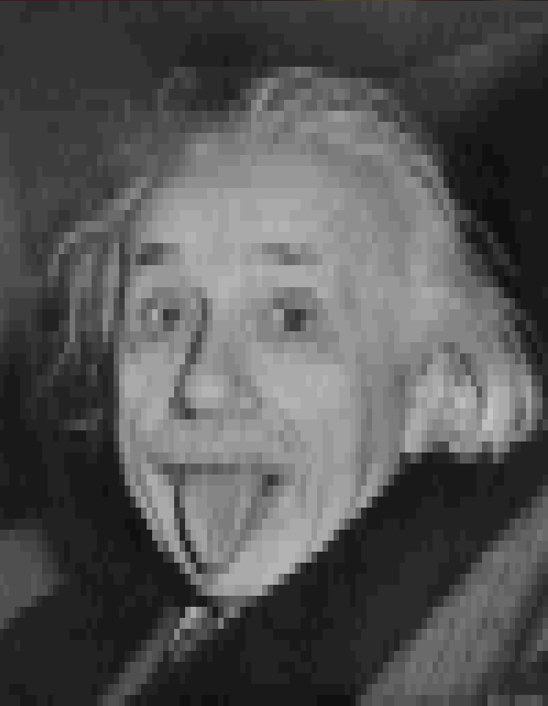

# ascii-art
Generate ascii art from pictures

Generation is done with Noto Mono for Powerline for regular text and Symbola for
unicode braille symbols. Results may look slightly different when using a
different font. Does not work on pngs.

Usage: `python main.py -h`

Requirements: 'scikit-imag', 'numpy', 'Pillow'

## Description

The purpose of this project is to convert images to ascii art. The basic
strategy is to take an n\*m resolution image and break it into chunks matching a
target resolution. I then use a variety of methods to convert each one of these
chunks into a single character, giving an ascii image of the target resolution.

The described strategies will be exemplified on this image of Albert Einstein.

### Strategy 1: Blockify

This was my first strategy, meant to act as a quick test to verify the algorithm
for breaking the image into chunks was working correctly. This strategy is to
convert the image pixels to grayscale, using a 0.2125/0.7154/0.0721 multiplier
for each of the rgb values. From there we just average all the values in the
chunk and scale that to a gray value from the 256 available ones in the
terminal. Using ansi escape codes, we can then print it out.

